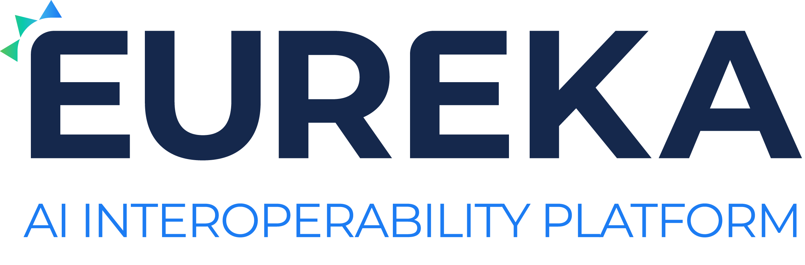

  

# Documentation And Examples Repository

You built an algorithm that could save lives. What happens next?

Partner with TeraRecon!

Read this documentation and explore our examples to learn how to integrate your algorithm into the Eureka AI Platform.

## Overview

To create a machine that can be deployed onto the platform via the [developer portal](http://portal.terarecon.com), these are the overview of the steps that will be required

- Create a product and add a machine to it
- Complete the input and output specification for your machine via the provided section on the portal
- Containerize your algorithm using the configured inputs and outputs
- Upload the container to the developer portal using supplied docker push commands for the machine
- Test machine with the provided portal evaluation section on the portal

These steps are further explained in our [walk-through](./docs/walkthrough.md)

## Basics and Terminology

### Accounts, Organizations, and Sharing
If you are the first person from your organization to sign up with the Eureka AI Platform, you can create an account and organization.

Your email address will be your username. 

If, however, your organization is already signed up, you must be invited to join
by one of your coworkers to gain access.
If you or others in your organization creates a new machine, your organization is now considered the _author_ of that machine.

### Product
The portal has the concept of a product that is a collection of various machines that are all for the same algorithm. This allows the grouping of machines that are conceptually the same algorithm, but they have different outputs for various sites depending on the type of outputs that are possible.

The biggest example of the need for this is a hospital that has an older PACS system and can not handle anything but a DICOM Secondary Capture result, but the machine created has the ability to output various result formats. 

So a machine needs to be created that just outputs DICOM Secondary Capture image and nothing else, but is still logically the same algorithm.

### Machine
Your algorithm can be any combination of trained statistical model, neural net, explicit procedure, decision tree or
anything else you can imagine.
In order for an algorithm to be used on the Eureka AI Platform, it must be packaged into a Docker container along with its runtime 
requirements, schema information, and other metadata.
We call this packaged container a _machine_.

### Schema
The data that your algorithm evaluates is called its _inputs_, the data your algorithm produces is called its _outputs_.
Both input and outputs must have well defined data type definitions called a _schema_.
The Eureka AI Platform uses a GUI for generating the required _inputs_ and _outputs_ for the machine found in the label creator section of a particular machine.

## Examples and References
The best way to learn about how to create a machine on the Eureka AI Platform is to read the [walk-through](./docs/walkthrough.md).

To learn more about _input_ and _output_ types, please see the [types reference](./docs/types.md).

It is also helpful to read through the [FAQ](./docs/faq.md)

To see an example that takes a single dicom series as input and uses pydicom and numpy to manipulate dicom image data and return it as a dicom series, look at: [test-dicom-series](./test-dicom-series)

To use a windows executable in the docker image, you should use wine.

## Get Started

To log into our site and try it out, visit the [developer portal](https://portal.terarecon.com)
