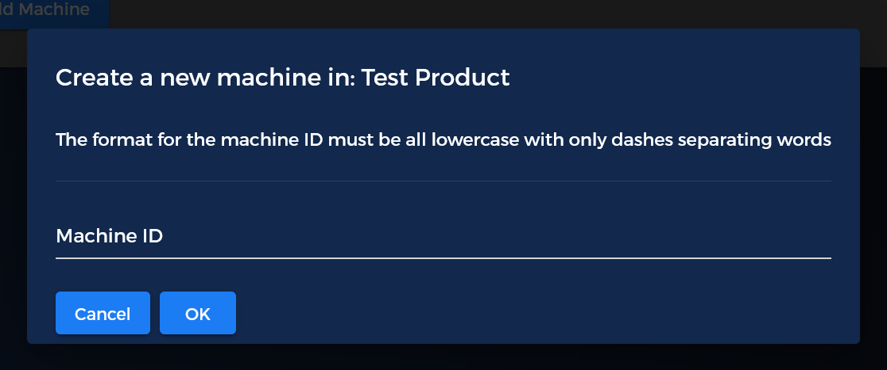
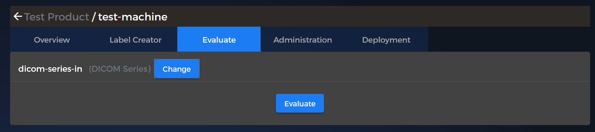

# Eureka AI Machine Creation Walk-through

This guide is to help with the star to finish creation of a machine on the developer portal. This will be using the test-hello example and will take a series as an input and return a series as an output.

- [Eureka AI Machine Creation Walk-through](#eureka-ai-machine-creation-walk-through)
  - [Create a Product](#create-a-product)
  - [Create a Machine](#create-a-machine)
  - [Fill out the Input/Output information for the machine](#fill-out-the-inputoutput-information-for-the-machine)
    - [Docker Properties](#docker-properties)
    - [Data Input / Output](#data-input--output)
    - [Machine Information](#machine-information)
  - [Build Machine](#build-machine)
        - [Tips for building a leaner Docker Image](#tips-for-building-a-leaner-docker-image)
  - [Upload Machine](#upload-machine)
  - [Test Machine](#test-machine)
    - [File Manager](#file-manager)
    - [Evaluate](#evaluate)

## Create a Product

A Product is meant to be a way to group all of the created machines that contain the same algorithm but have different outputs.

*An example of a product with many machines*

To create a product, click the  icon in the upper right of the product summary screen to launch the product creation modal.

After filling in the requested information for the product, you should be returned to the product summary screen wit the newly created product present.
You should now be able to create your first machine for this product.

## Create a Machine

To add a machine for a product. Click the 'Add a Machine' button from the product screen or the  button on the machines tab in the product overview section.

*Machine creation dialog*

Once either button is clicked, the 'Create a Machine' modal will be presented to you. At this point, the platform asks you to fill in some information about the machine that is going to be created, such as:

- Machine ID (all lowercase, the only special character supported is _-_ )
- Type of base docker operating system the machine is going to use
  - linux based image
  - linux based image with Nvidia GPU requirements
  - windows based image
- Average number of slices the machine is expected to process
- Runtime based on the above average case size
- Number of Minium Cores required by the machine
- Minimum Memory requirements based on the above average case size

Once this information is entered, click on the Ok button. After validation for machine id is completed, the machine will be created into the system.

The next step is to define the _inputs_ and _outputs_ you would like the machine to have

## Fill out the Input/Output information for the machine

After a machine is created, the final step before uploading your machine is to define the _inputs_ and _outputs_ that are required by the machine.

In the past, it was required that the developer fill out a docker label with all the appropriate information as a LABEL section in the Dockerfile. This had to be in either YAML or JSON format and was prone to errors.

 With the current version of the portal, all of this is handled by the 'Label Creator' in the machine section. This uses a GUI to define the _input_ / _output_ keys quickly and accurately and allows them to be associated with what ever docker machine is uploaded to the portal for that specific machine.

The label creator has 3 parts to configuring a machine
- _Docker Properties_: Information about what resources the docker image is going to use
- _Data Input / Output_: Defines the input and output data the machines requires
- _Machine Information_: Extra information that will be passed along with the machine

Explanations of all input/output types are available at [Eureka AI Machine API - Data Types Reference](types.md)

### Docker Properties

*Docker Properties overview for a machine*

On the docker properties section, the different resources that are required for the running of the machine are defined here. 

### Data Input / Output

*Machine Input and Output specification section*

In the Data Input / Output section, all of the required inputs and outputs from the machine are configured here. The keys that are provided for the various items will end up being part of the path name for the files that are provided to the machine.

### Machine Information

*Machine information section*

Once all of this information is filled in, it's associated with the machine. This means the only thing left to do is to upload the machine via docker to the portal and test it via the 'Evaluate' tab.

## Build Machine

Build your algorithm into a docker by using your Dockerfile.

##### Tips for building a leaner Docker Image

- Minimize layers by consolidating run commands into a single command
- clean up after the package manager by adding this command at end of installer line
  - for apt add: rm -rf /var/lib/apt/lists/*
  - for yum add: yum clean all
- Use  --no-install-recommends on apt-get install commands to prevent unwanted packages being installed

## Upload Machine

Once your machine is built on your local or Continuous Integration environment, the specific tag that is required to upload to the portal is located in the machine 'Administration' tab under the 'Get Push Commands' section.

In this section, you use the docker login command to obtain access to your specific repository associated only to your account/machine.

The commands can be copied from the website to make it easier to upload the image to the docker registry. This can be accomplished many different ways and order, but the most important thing to take notice of is the tag name from the commands. This must be the entry from the portal or it will not upload properly to the registry.

## Test Machine

Once the machine has been uploaded to the repository using the commands from the portal, it can be tested by selecting your machine and going to the 'Evaluate' tab. Once on this tab, it should show you the configured inputs that you have entered in the 'Label Creator' section.

At this point, the inputs need to be selected from the files uploaded to the file manager.

### File Manager

*example file manager view*

This is the simple file manager for managing the evaluation data for machines uploaded to the portal. 

_All DICOM data that is uploaded to the portal should contain no patient data._

The functions in the file manager are:
- Refresh the data from server
- Add a new folder
- Delete selected items
- Upload File / Folder
- Download selected items (zipped before download)

### Evaluate

*example of machine evaluation with a single series input*

The 'Evaluate' machine tab will allow you to run the machine with the inputs that were configured in the 'Label Creator'. 
